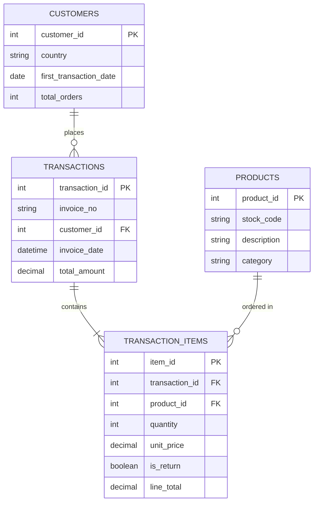

# Database Schema Diagram - Text for draw.io

## Instructions:
1. Go to https://app.diagrams.net/
2. Create New Diagram → Entity Relationship
3. Create 4 table shapes with the fields below

## Alternative: Use Mermaid (Easiest!)

Go to https://mermaid.live/ and paste this code:



## Manual Creation in draw.io:

### Table 1: CUSTOMERS
```
┌─────────────────────────────┐
│        CUSTOMERS            │
├─────────────────────────────┤
│ 🔑 customer_id (INT)        │
│    country (VARCHAR)        │
│    first_transaction_date   │
│    total_orders (INT)       │
└─────────────────────────────┘
```

### Table 2: PRODUCTS
```
┌─────────────────────────────┐
│         PRODUCTS            │
├─────────────────────────────┤
│ 🔑 product_id (INT)         │
│    stock_code (VARCHAR)     │
│    description (TEXT)       │
│    category (VARCHAR)       │
└─────────────────────────────┘
```

### Table 3: TRANSACTIONS
```
┌─────────────────────────────┐
│       TRANSACTIONS          │
├─────────────────────────────┤
│ 🔑 transaction_id (INT)     │
│    invoice_no (VARCHAR)     │
│ 🔗 customer_id (INT)        │
│    invoice_date (DATETIME)  │
│    total_amount (DECIMAL)   │
└─────────────────────────────┘
```

### Table 4: TRANSACTION_ITEMS
```
┌─────────────────────────────┐
│     TRANSACTION_ITEMS       │
├─────────────────────────────┤
│ 🔑 item_id (INT)            │
│ 🔗 transaction_id (INT)     │
│ 🔗 product_id (INT)         │
│    quantity (INT)           │
│    unit_price (DECIMAL)     │
│    is_return (BOOLEAN)      │
│    line_total (DECIMAL)     │
└─────────────────────────────┘
```

## Relationships (Draw arrows):

1. **CUSTOMERS to TRANSACTIONS**
   - Type: One-to-Many
   - From: customer_id (CUSTOMERS)
   - To: customer_id (TRANSACTIONS)
   - Label: "places"

2. **TRANSACTIONS to TRANSACTION_ITEMS**
   - Type: One-to-Many
   - From: transaction_id (TRANSACTIONS)
   - To: transaction_id (TRANSACTION_ITEMS)
   - Label: "contains"

3. **PRODUCTS to TRANSACTION_ITEMS**
   - Type: One-to-Many
   - From: product_id (PRODUCTS)
   - To: product_id (TRANSACTION_ITEMS)
   - Label: "ordered in"

## Legend:
- 🔑 = Primary Key
- 🔗 = Foreign Key
- || = One (exactly one)
- |{ = Many (one or more)
- o{ = Zero or more

## Quick Option: dbdiagram.io

Go to https://dbdiagram.io/d and paste this code:

```
Table customers {
  customer_id int [pk, increment]
  country varchar
  first_transaction_date date
  total_orders int
}

Table products {
  product_id int [pk, increment]
  stock_code varchar
  description text
  category varchar
}

Table transactions {
  transaction_id int [pk, increment]
  invoice_no varchar
  customer_id int [ref: > customers.customer_id]
  invoice_date datetime
  total_amount decimal
}

Table transaction_items {
  item_id int [pk, increment]
  transaction_id int [ref: > transactions.transaction_id]
  product_id int [ref: > products.product_id]
  quantity int
  unit_price decimal
  is_return boolean
  line_total decimal
}
```

Then click "Export" → "Export to PNG"

## Recommended Approach:
**Use Mermaid.live** - it's the fastest and creates professional diagrams automatically!
